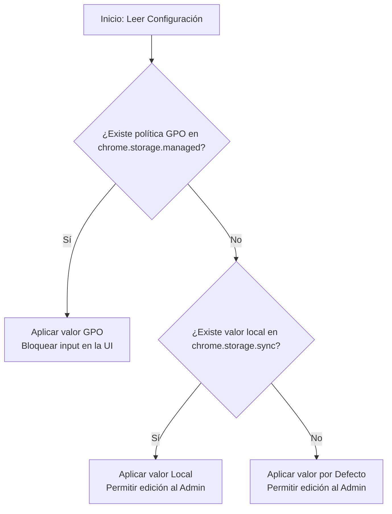

# Plan Detallado de Modernización y Nuevas Funcionalidades

Este plan técnico describe la hoja de ruta detallada para modernizar **Chrome Tab Monitor** y agregar las funcionalidades solicitadas. Está diseñado con un enfoque educativo, explicando los conceptos de ingeniería de software involucrados para que aprendas mientras desarrollas.

---

## 🎯 Objetivos de la Actualización

1. **Escalabilidad y Modernización del Stack:** Migración a Node.js + Vite + React + TypeScript para tener un entorno de desarrollo profesional con tipeado estricto y componentes modulares.
2. **Autenticación Administrativa Local:** Implementación de un sistema de login local (usuario y contraseña) para desbloquear la configuración de la extensión, almacenando credenciales de forma segura localmente (sin servicios externos).
3. **Compatibilidad con GPO de Windows (Managed Storage):** Capacidad para desplegar la extensión a nivel empresarial mediante políticas de grupo (GPO), permitiendo a los administradores de sistemas forzar límites de pestañas y ventanas de manera remota e inmutable por el usuario común.
4. **Diseño Visual de Alta Gama (UI/UX con Tailwind CSS):** Renovación estética para crear una interfaz premium con Tailwind, animaciones fluidas y un diseño moderno (soporte de estados activos/bloqueados por GPO).
5. **Enfoque Didáctico:** Cada fase del desarrollo servirá para profundizar en conceptos avanzados de JavaScript/TypeScript, APIs de navegadores, seguridad local y diseño de arquitectura.

---

## 🏛️ Diseño de Arquitectura y Precedencia

### 1. Modelo de Precedencia de Configuraciones
Para soportar políticas empresariales (GPO) y configuraciones locales de usuario de manera consistente, implementaremos una **cadena de precedencia de 3 niveles**:



* **Prioridad 1: Políticas GPO (`chrome.storage.managed`)**
  * Tienen máxima prioridad. Si una política (ej. `tabLimit`) se define vía GPO, se aplica directamente, y la interfaz gráfica del usuario la mostrará con un icono de candado/empresa y deshabilitada para edición, incluso para el administrador local.
* **Prioridad 2: Configuración del Administrador Local (`chrome.storage.sync`)**
  * Si no hay política GPO definida para un campo, se lee este almacenamiento. Solo se puede editar si el usuario ha iniciado sesión como administrador.
* **Prioridad 3: Configuración por Defecto (`DEFAULT_CONFIG`)**
  * Valores iniciales codificados en la extensión en caso de que no existan datos locales ni GPO.

### 2. Flujo de Autenticación Local
Para evitar servidores externos, la autenticación se realizará a nivel local:
* **Primera ejecución:** Si no hay credenciales definidas, la extensión pedirá configurar un usuario y contraseña de administrador.
* **Almacenamiento seguro:** Las credenciales se guardarán en `chrome.storage.local`. Para no guardar la contraseña en texto plano (mala práctica de seguridad), usaremos la Web Cryptography API de JavaScript para generar un **hash seguro** de la contraseña (por ejemplo, usando `PBKDF2` o `SHA-256` con sal).
* **Gestión de Sesión:** Cuando el usuario ingresa las credenciales correctas en el popup, se establece una sesión temporal (ya sea guardando un timestamp de login en `chrome.storage.session` que expire tras N minutos, o en el estado en memoria de la UI).

---

## 📋 Fase a Fase: Guía de Implementación Paso a Paso

### 🚀 Fase 1: Inicialización del Entorno Node.js + TypeScript
* **Conceptos clave a aprender:** Gestión de dependencias en Node, estructura de un compilador de TypeScript (`tsconfig.json`), compatibilidad de targets de ECMAScript con Chrome MV3.
* **Pasos:**
  1. Crear archivo `.nvmrc` para fijar la versión de Node (ej. `20.x`).
  2. Inicializar el proyecto con `npm init -y` para generar el `package.json`.
  3. Instalar dependencias de desarrollo fundamentales:
     ```bash
     npm install -D vite @crxjs/vite-plugin typescript react react-dom @types/react @types/react-dom @types/chrome
     ```
  4. Configurar `tsconfig.json` ajustado a extensiones Chrome (debe compilar a un target compatible con service workers modernos como `ES2022`).
  5. Configurar `.gitignore` para no subir `node_modules/`, `dist/` ni archivos temporales.

---

### 📦 Fase 2: Configuración de Vite y CRXJS (El Build System)
* **Conceptos clave a aprender:** Cómo funciona el bundler Vite, cómo CRXJS analiza el `manifest.json` como punto de entrada de la app, diferencia entre recarga de popup (HMR) y recarga del Service Worker.
* **Pasos:**
  1. Crear `vite.config.ts` importando `@vitejs/plugin-react` y `@crxjs/vite-plugin`.
  2. Ajustar `manifest.json` para apuntar a los nuevos puntos de entrada:
     * El Service Worker se moverá a `src/background/index.ts`.
     * El Popup se moverá a `src/popup/index.html` (el cual carga `src/popup/main.tsx`).
  3. Configurar scripts en `package.json` para desarrollo (`npm run dev`) y compilación (`npm run build`).

---

### 🌐 Fase 3: Migración a TypeScript (Background y Utils)
* **Conceptos clave a aprender:** Tipos genéricos, tipado estricto en APIs asíncronas de Chrome (`chrome.tabs`, `chrome.windows`), refactorización segura sin alterar lógica de negocio.
* **Pasos:**
  1. Crear `src/shared/types.ts` para centralizar la interfaz `ExtensionConfig` y los tipos de logs y estadísticas.
  2. Reorganizar carpetas creando `src/background/` y `src/background/utils/`.
  3. Renombrar cada utilidad (`config.js`, `tabManager.js`, etc.) a `.ts` y agregar tipos estricto en todos los parámetros y retornos.
  4. Asegurar que las llamadas asíncronas a Chrome APIs manejen correctamente las Promesas o callbacks antiguos de manera limpia.

---

### 🏛️ Fase 4: Soporte GPO (Managed Storage Enterprise)
* **Conceptos clave a aprender:** Cómo la API `chrome.storage.managed` lee las políticas impuestas por el registro de Windows (`HKEY_LOCAL_MACHINE\Software\Policies\Google\Chrome...`), validación de esquemas JSON en Chrome.
* **Pasos:**
  1. Crear el archivo `schema.json` en la raíz, declarando el esquema oficial JSON para nuestras variables configurables:
     ```json
     {
       "type": "object",
       "properties": {
         "enabled": { "type": "boolean" },
         "tabLimit": { "type": "integer", "minimum": 1, "maximum": 100 },
         "windowLimit": { "type": "integer", "minimum": 1, "maximum": 10 }
       }
     }
     ```
  2. Declarar el esquema en `manifest.json`:
     ```json
     "storage": {
       "managed_schema": "schema.json"
     }
     ```
  3. Modificar la utilidad de configuración (`config.ts`) para implementar la fusión de configuraciones según la precedencia:
     * Consultar `chrome.storage.managed.get()` antes de devolver la configuración.
     * Retornar una estructura que indique qué campos están bloqueados por política enterprise.

---

### 💅 Fase 5: UI Moderna con React y Tailwind CSS
* **Conceptos clave a aprender:** Configuración de Tailwind CSS con compilación de Vite, ciclo de vida de componentes React, manejo de estados en componentes de interfaz.
* **Pasos:**
  1. Instalar Tailwind CSS y PostCSS:
     ```bash
     npm install -D tailwindcss postcss autoprefixer
     npx tailwindcss init -p
     ```
  2. Configurar `tailwind.config.js` para escanear archivos `.html`, `.ts` y `.tsx`.
  3. Crear la estructura de componentes React en `src/popup/components/` (Header, StatsCard, WindowList, LogsPanel, ConfigPanel).
  4. Implementar un diseño premium con modo oscuro, esquinas redondeadas, transiciones suaves y estados especiales para elementos bloqueados por GPO.

---

### 🔒 Fase 6: Autenticación de Administrador Local
* **Conceptos clave a aprender:** Criptografía en el navegador con `Web Crypto API` (funciones hash `SHA-256`, salado de contraseñas), persistencia segura de datos de sesión.
* **Pasos:**
  1. Crear un módulo de criptografía `src/popup/utils/crypto.ts` para gestionar el hashing de contraseñas.
  2. Implementar un componente `Login.tsx` en el popup.
  3. Si la contraseña no está configurada, mostrar una pantalla inicial para definirla.
  4. Crear controles visuales en el panel de configuración que estén deshabilitados hasta que el usuario inicie sesión correctamente como Administrador.

---

### 🧪 Fase 7: Testing con Vitest y Mocks de Chrome
* **Conceptos clave a aprender:** Pruebas unitarias de lógica pura, técnicas de Mocking para APIs globales del sistema operativo o navegador (mockear `chrome`).
* **Pasos:**
  1. Instalar Vitest y dependencias de testeo:
     ```bash
     npm install -D vitest @testing-library/react jsdom
     ```
  2. Crear mock global para el objeto `chrome` (por ejemplo, simulando el comportamiento de `chrome.tabs.query`, `chrome.storage.sync` y `chrome.storage.managed`).
  3. Escribir pruebas unitarias para `tabManager.ts` y la combinación de precedencia en `config.ts`.

---

### 🤖 Fase 8: Integración Continua (CI/CD)
* **Conceptos clave a aprender:** Flujos de trabajo de GitHub Actions, variables de entorno secretas, empaquetado automático de artefactos en la nube.
* **Pasos:**
  1. Configurar un workflow en `.github/workflows/ci.yml` que corra `npm run lint`, pruebas unitarias (`npm run test`) y compilación en cada Pull Request.
  2. Configurar un workflow de release que empaquete la carpeta `dist/` en un archivo `.zip` y lo suba como asset cuando se publique una nueva etiqueta de versión (`v*`).

---

## 🛠️ Configuración de Prueba de GPO en Windows (Local)
Para probar localmente las configuraciones de políticas (GPO) sin necesidad de tener un servidor de Dominio de Windows Active Directory:
1. Instalar la extensión en Chrome en modo desarrollador y copiar su ID (ejemplo: `abcdefghijklmnopqrstuvwxyz`).
2. Abrir el editor de registro de Windows (`regedit`).
3. Navegar a:
   `HKEY_LOCAL_MACHINE\SOFTWARE\Policies\Google\Chrome\3rdparty\extensions\[TU_EXTENSION_ID]\policy`
   *(Si las carpetas `3rdparty`, `extensions` o el ID no existen, debes crearlas haciendo clic derecho -> Nuevo -> Clave).*
4. Dentro de la clave `policy`, crear valores según los tipos definidos en tu `schema.json`:
   * Ejemplo: Crear un valor de tipo **DWORD** (32 bits) con nombre `tabLimit` y asignarle el valor decimal `4`.
5. Abrir en Chrome `chrome://policy`, hacer clic en "Volver a cargar políticas" y verificar que la política de tu extensión se cargue correctamente con el nuevo límite.
